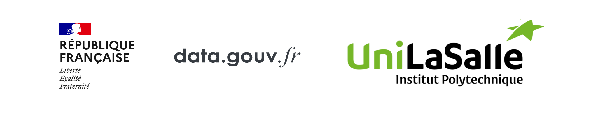

[](https://www.gnu.org/licenses/gpl-3.0)     [](https://www.python.org/dev/peps/pep-0008/) [](https://python-poetry.org/)  

<br> 

# rica-analysis @unilasalle

## Description

This repository contains the code to download, analyse, and modelize the RICA dataset from the french ministry of agriculture.

Please find more information about the dataset [here](https://www.data.gouv.fr/en/).


## Installation

Using *poetry* (higly recommended) : 

```bash
poetry install
```

Using *pip/venv* : 

```bash
python -m venv .venv
source .venv/bin/activate
pip install -r .utils/requirements.txt
```

## Usage

Using *poetry* (higly recommended) : 
```bash
poetry shell
```

Using *pip/venv* : 
```bash
source .venv/bin/activate
```

Please refer to the [CONTRIBUTING.md](CONTRIBUTING.md) file for more information.


## Contributing

Please refer to the [CONTRIBUTING.md](CONTRIBUTING.md) file for more information.

## Documentation

Please visti the [documentation](https://alexandregazagnes.github.io/rica-analysis) for more information.

## License

This project is licensed under the GNU GPLv3 License - see the [LICENSE.md](LICENSE.md) file for details


## Authors

Alexandre Gazagnes : 
- github : [alexandregazagnes](https://github.com/AlexandreGazagnes)
- linkedin : [alexandre-gazagnes](https://www.linkedin.com/in/alexandregazagnes/) 
- twitter : [AlexGazagnes](https://twitter.com/Alex_Gazagnes)

